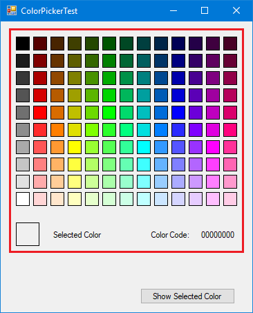

# ColorPickerControl
Windows Forms Control which allows to pick a color

This is how the control (the part inside the red rectangle) looks like on a test form:

## Properties:

### SelectedColor
Allows to get/set the selected Color in the control

### ShowColorCode
Property to show or hide the hex value of the selected color in the lower right

## Events

### SelectionChanged
Allows to hook up an event receiver which is invoked everytime the selected color changes